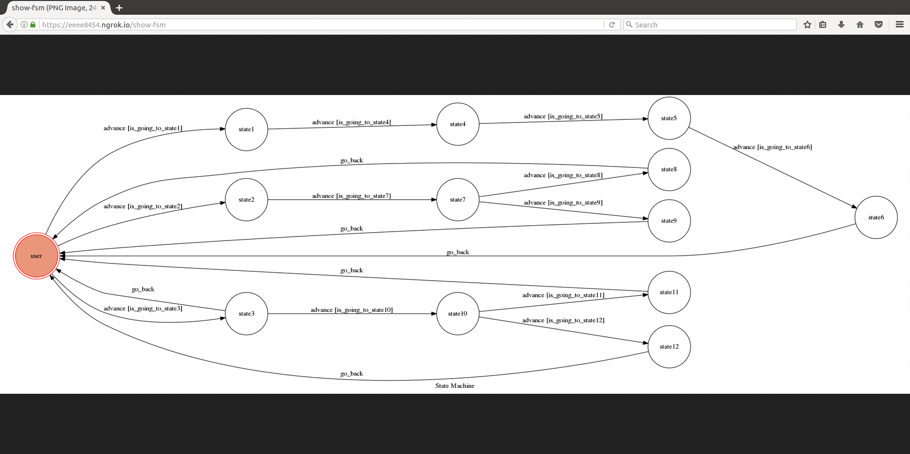

## Finite State Machine

## Usage
我寫的是肥宅問候女生的chatbot
一開始是在'user'
此時可以選擇三個選擇分隻並且以"->"代表advance，並且chatbot會回應文字
1. calling to senior sister -> hello -> why you just have read? -> tt 最後回到user
2. calling to junior sister -> i have some tickets,duo with me? (這邊有2個分支，會回答不同答案)

(1.-> how about the next weekend?)
(2.-> how about the next week?)

3. hey younger-> how could i have girlfriend? -> external condition
                                              -> internal condition(可以有2個分支)

## Author
[asdsdlgl](https://github.com/asdsdlgl)
